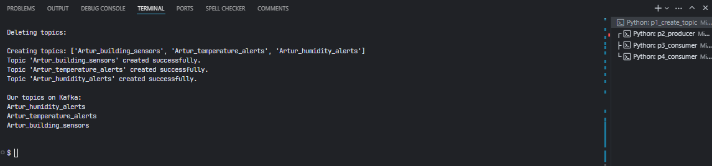
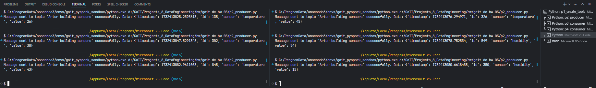
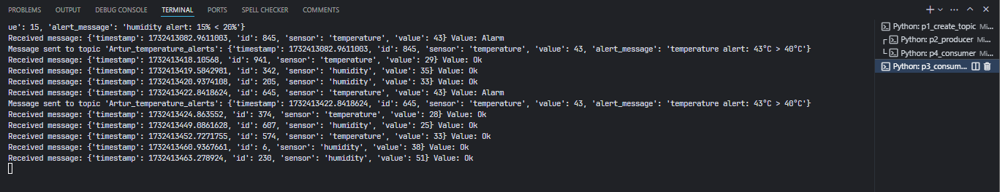
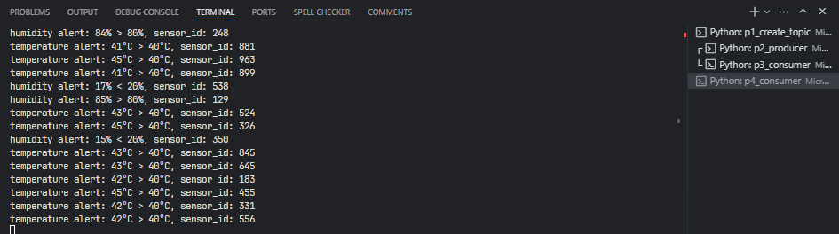
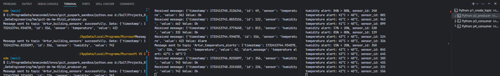

# goit-de-hw-05. Apache Kafka

## 1. Створення топіків в Kafka:

- Створіть три топіки в Kafka:

  До імен топіків добавте свої імена або інші ідентифікатори, щоб імена топіків не дублювалися.

- `building_sensors` — для зберігання даних з усіх датчиків,
- `temperature_alerts` — для зберігання сповіщень про перевищення допустимого рівня температури,
- `humidity_alerts` — для зберігання сповіщень про вихід рівня вологості за допустимі рамки.

---

### Рішення

[p1_create_topic.py](p1_create_topic.py)

Скрин трьох топіків:

## 2. Відправка даних до топіків:

- Напишіть Python-скрипт, який імітує роботу датчика і періодично відправляє випадково згенеровані дані (температура та вологість) у топік `building_sensors`.
- Дані мають містити ідентифікатор датчика, час отримання даних та відповідні показники.
- Один запуск скрипту має відповідати тільки одному датчику. Тобто, для того, щоб імітувати декілька датчиків, необхідно запустити скрипт декілька разів.

  ID датчика може просто бути випадковим числом, але постійним (однаковим) для одного запуску скрипту. При повторному запуску ID датчика може змінюватись.

- Температура — це випадкова величина від 25 до 45.
- Вологість — це випадкова величина від 15 до 85.

---

### Рішення

[p2_producer.py](p2_producer.py)

Скрин генерації даних сенсорів та відправки даних в building_sensors з демонстрацією двох (або більше) одночасних роботи двох запусків програми

## 3. Обробка даних:

- Напишіть Python-скрипт, який підписується на топік `building_sensors`, зчитує повідомлення і перевіряє отримані дані:
- якщо температура перевищує 40°C, генерує сповіщення і відправляє його в топік `temperature_alerts`;
- якщо вологість перевищує 80% або сягає менше 20%, генерує сповіщення і відправляє його в топік `humidity_alerts`.
- Сповіщення повинні містити ідентифікатор датчика, значення показників, час та повідомлення про перевищення порогового значення.

---

### Рішення

[p3_consumer.py](p3_consumer.py)

Скрин отримання даних та фільтрації саме тих даних, що будуть далі використані, з демонстрацією того, що відфільтровані дані були послані у відповідні топіки:

## 4. Остаточні дані:

Напишіть Python-скрипт, який підписується на топіки temperature_alerts та humidity_alerts, зчитує сповіщення виводить на екран повідомлення.

---

### Рішення

[p4_consumer.py](p4_consumer.py)

Cкрин з результатом запису відфільтрованих даних:

